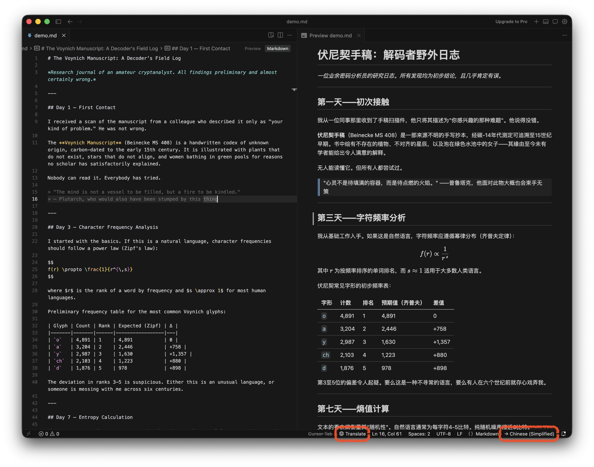

<p align="center">
  
</p>

<h1 align="center">vscode-cursor-md-translator</h1>

<p align="center">
  <a href="README.md">English</a> &nbsp;|&nbsp;
  <b>中文</b> &nbsp;|&nbsp;
  <a href="README_ja.md">日本語</a>
</p>

<p align="center">
  <a href="LICENSE"></a>
  
  
  <a href="https://github.com/DongkunXu/vscode-cursor-md-translator/releases"></a>
</p>

<p align="center">
  将任意 Markdown 文件翻译为目标语言，格式完全无损。<br>
  支持 <b>VS Code</b>、<b>Cursor</b> 及所有基于 VS Code 引擎的编辑器。<br>
  接入任何兼容 OpenAI 接口的服务 —— OpenAI、DeepSeek、Ollama 等。
</p>

---

<p align="center">
  
</p>

## 功能特性

- **格式无损** — 代码块、行内代码、数学公式（`$$` / `$`）、表格、引用块、任务列表、脚注全部用占位符保护，模型不会触碰任何格式符号
- **原生预览** — 翻译结果直接在 VS Code 内置 Markdown 预览中渲染，完整支持语法高亮、主题和已安装插件
- **兼容所有 OpenAI 兼容接口** — OpenAI、DeepSeek、Azure OpenAI、Ollama（本地）或任何实现了 `/chat/completions` 的服务
- **智能分块** — 按标题和段落边界分割大文档，不限文件大小
- **状态栏一键操作** — 无论焦点在哪个面板，底部状态栏的 `$(globe) Translate` 按钮始终可见
- **18 种目标语言** — 点击状态栏语言标签即可切换

## 安装

**从 GitHub Releases 安装（推荐）**

1. 从 [**Releases**](https://github.com/DongkunXu/vscode-cursor-md-translator/releases) 下载最新 `.vsix` 文件
2. `Cmd+Shift+P` → **Extensions: Install from VSIX…** → 选择文件
3. `Cmd+Shift+P` → **Developer: Reload Window**

**从源码构建**

```bash
git clone https://github.com/DongkunXu/vscode-cursor-md-translator.git
cd vscode-cursor-md-translator
npm install && npm run generate-icon && npm run compile && npm run package
# 然后按上面步骤安装生成的 .vsix
```

## 配置

在设置（`Cmd+,`）中搜索 **"Markdown Translator"**，或直接编辑 `settings.json`：

| 配置项 | 默认值 | 说明 |
|---|---|---|
| `mdTranslator.apiBaseUrl` | `https://api.openai.com/v1` | API 基础地址 |
| `mdTranslator.apiKey` | *(空)* | API 密钥 |
| `mdTranslator.model` | `gpt-4o` | 模型名称 |
| `mdTranslator.targetLanguage` | `Chinese (Simplified)` | 目标语言 |
| `mdTranslator.chunkSize` | `3000` | 每次 API 调用最大字符数 |
| `mdTranslator.requestTimeoutMs` | `90000` | 请求超时时间（毫秒） |

**各平台配置示例**

<details>
<summary>OpenAI</summary>

```jsonc
"mdTranslator.apiBaseUrl": "https://api.openai.com/v1",
"mdTranslator.apiKey": "sk-...",
"mdTranslator.model": "gpt-4o"
```
</details>

<details>
<summary>DeepSeek（推荐，性价比高）</summary>

```jsonc
"mdTranslator.apiBaseUrl": "https://api.deepseek.com/v1",
"mdTranslator.apiKey": "sk-...",
"mdTranslator.model": "deepseek-chat"
```
</details>

<details>
<summary>Ollama（本地运行，无需密钥）</summary>

```jsonc
"mdTranslator.apiBaseUrl": "http://localhost:11434/v1",
"mdTranslator.apiKey": "ollama",
"mdTranslator.model": "llama3"
```
</details>

## 使用方法

打开任意 `.md` 文件，三种入口：

| 入口 | 操作 |
|---|---|
| **状态栏** | 点击右下角 `$(globe) Translate` 按钮 |
| **右键菜单** | 在编辑器内右键 → *Markdown Translator: Open Translated Preview* |
| **命令面板** | `Cmd+Shift+P` → *Markdown Translator: …* |

**切换目标语言** — 点击状态栏中 `→ Chinese (Simplified)` 标签，即可弹出语言选择框。

**翻译为新文档** — 使用 *Markdown Translator: Translate to New Document*，结果以可编辑的新文档形式打开，可直接另存为文件。

## 工作原理

```
原始 .md 文件
    │
    ├─ 1. 提取 YAML Front Matter（原样保留）
    ├─ 2. 代码块 / 行内代码 / 数学公式 替换为占位符
    ├─ 3. 相对图片路径 → 绝对 file:// URI
    ├─ 4. 按标题 / 段落边界分块
    ├─ 5. 逐块调用 LLM 翻译（temperature 0.1）
    └─ 6. 还原占位符 → VS Code 内置预览渲染
```

## 贡献

欢迎提交 PR，重大改动请先开 Issue 讨论。

## 许可证

[MIT](LICENSE) © 2025 [Dongkun Xu](https://github.com/DongkunXu)
